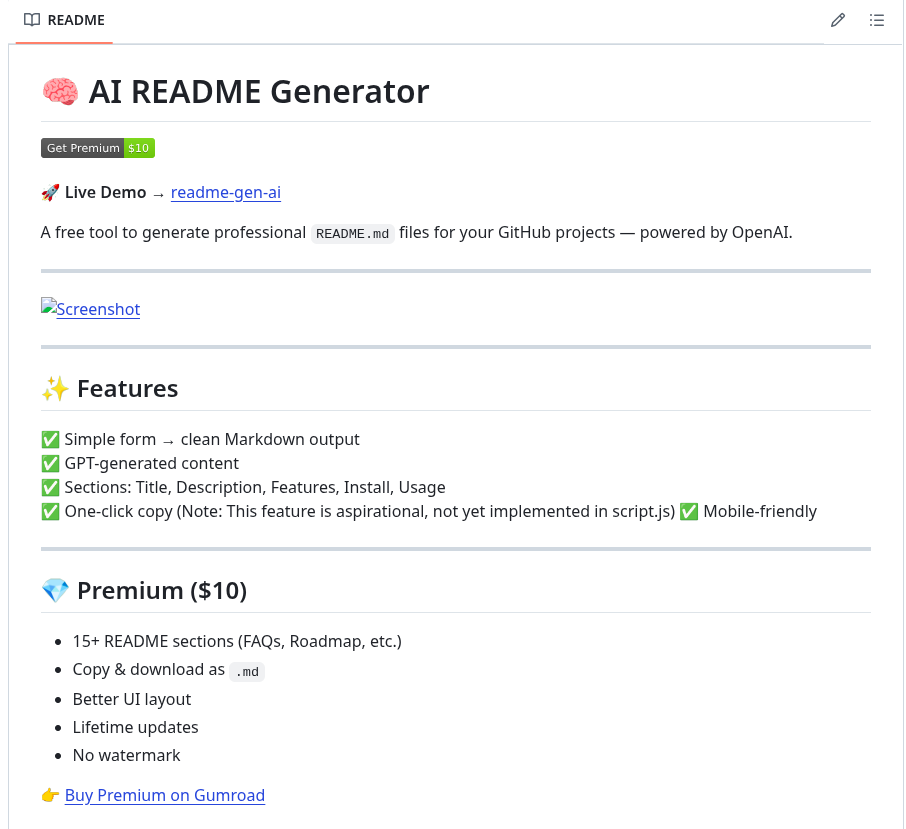

# 🧠 AI README Generator

🚀 **Live Demo** → [https://yourusername.github.io/readme-gen-ai](https://yourusername.github.io/readme-gen-ai)

A simple AI-powered tool that helps you instantly generate professional `README.md` files for your GitHub projects.

Built using OpenAI + plain HTML/CSS/JS. Hosted free with GitHub Pages.

---

---

## ✨ Features

✅ Simple form to generate clean, professional `README.md` files  
✅ Uses OpenAI (GPT) for high-quality markdown  
✅ Supports key sections: Title, Description, Features, Install, Usage, License  
✅ One-click copy to clipboard (Note: This feature is not implemented in the current script, but is a good aspiration)
✅ Mobile-friendly UI

---

## 💎 Premium Version ($10)

- 15+ sections (Roadmap, Screenshots, Contributing, FAQs, etc.)
- Enhanced UI layout
- Export to `.md` file
- Lifetime updates
- No ads or watermark

🎁 [Buy Premium Here](https://gumroad.com/yourlink)

---

## 📦 How to Use

1. Open the [Live Demo](https://yourusername.github.io/readme-gen-ai)
2. **Get an OpenAI API Key:** If you don't have one, sign up at [https://openai.com/](https://openai.com/).
3. **Enter API Key:** Paste your API key into the "OpenAI API Key" field on the webpage.
   *   **Security Note:** Your API key is used directly in the browser. For personal use, this is fine. **Never expose your API key in a public repository or client-side code for a production application.** Consider a backend proxy for production.
4. Fill out the form with your project details.
5. Click "Generate README".
6. Copy your README from the output area to your project's `README.md` file. ✅

---

## 📬 Contact

- Twitter: [@yourhandle](https://twitter.com/yourhandle)
- Email: your@email.com
- IndieHackers: [yourprofile](https://indiehackers.com/yourprofile)

---

**Tags:** `readme-generator`, `openai`, `tool`, `indiehack`, `sideproject`, `gpt`
